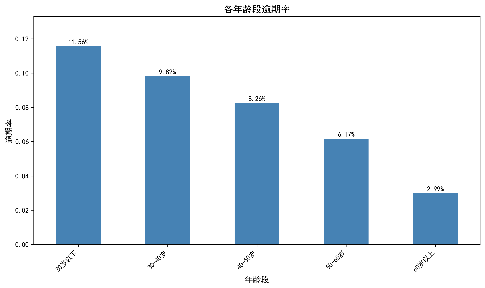
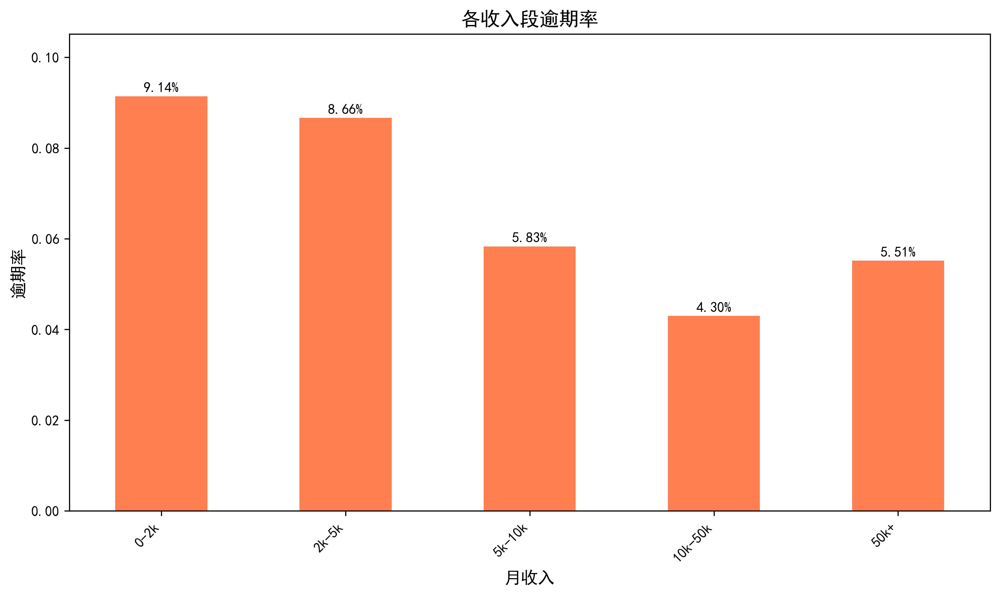
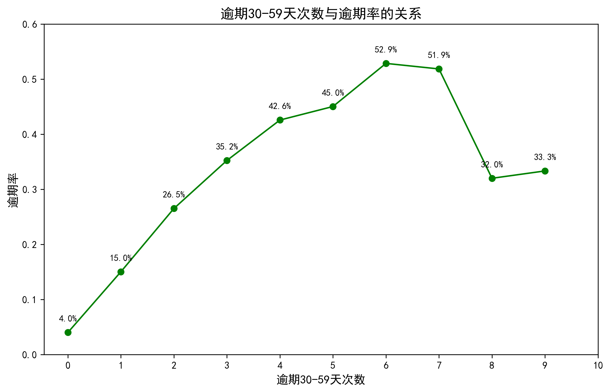

# 信用卡贷款违约预测分析

## 项目概述
基于15万条银行信贷数据，构建贷款违约预测模型，识别高风险客户特征，输出风控策略建议。

## 项目背景
在银行信贷业务中，准确识别高风险客户对于控制坏账率至关重要。本项目通过分析客户的历史行为数据，构建违约预测模型，为银行提供数据驱动的风控决策支持。

## 数据集
- 来源：Kaggle / 和鲸社区
- 样本量：150,000条
- 特征数：11个（包括年龄、收入、历史逾期次数、负债比率等）

## 核心发现可视化

### 各年龄段逾期率


### 各收入段逾期率


### 逾期次数与逾期率的关系


## 核心发现
1. **历史逾期次数是违约的最强预测因子**
   - 有过1次逾期记录的客户，违约率从4%飙升至15%
   - 有过5次以上逾期记录的客户，违约率超过50%
   
2. **年轻客群风险更高**
   - 30岁以下客户违约率11.56%，是60岁以上客户的3.8倍
   
3. **低收入群体违约风险更高**
   - 月收入低于5000元的客户违约率接近9%

## 分析方法
1. **数据清洗**：处理缺失值（月收入用中位数填充）、异常值（年龄>0，负债比率上限100）
2. **探索性分析（EDA）**：年龄/收入/历史逾期次数与违约率的关系
3. **特征工程**：对数变换、标准化、年龄分箱、收入分箱
4. **建模**：逻辑回归（处理样本不平衡），AUC达到0.83

## 模型表现
- 算法：逻辑回归（处理样本不平衡）
- **AUC：0.83**
- 特征工程：对数变换 + 标准化后，模型完全收敛

## 业务建议
1. **逾期预警机制**：对出现1次逾期记录的客户，及时发送短信提醒并适当降低额度
2. **差异化审批**：对30岁以下、月收入低于5000元的申请者，要求提供更多还款能力证明
3. **客户画像应用**：将高风险特征纳入贷前审批评分卡

## 技术栈
- Python 3.x
- Pandas / NumPy
- Matplotlib / Seaborn
- Scikit-learn

## 如何运行
```bash
# 克隆仓库
git clone https://github.com/Flipped-zx666/credit_risk_analysis.git

# 安装依赖
pip install -r requirements.txt

# 运行分析脚本
python scripts/analysis.py
